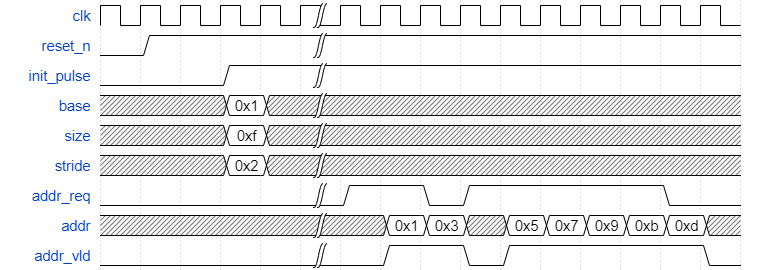

### Parameters
DEPTH : Nested Level of For Loop  
AW : Address Width

### Description
Address Gen with DEPTH 3
```python
for k in range(size[2]):
    for j in range(size[1]):
        for i in range(size[0]):
            addr = base + i*stride[0] + j*stride[1] + k*stride[2]
```

### Waveform


### Power

### Area

### Coverage
Total Coverage Summary
|SCORE|LINE|COND|FSM|BRANCH|
|:-:|:-:|:-:|:-:|:-:|
|100.00|100.00|--|--|100.00